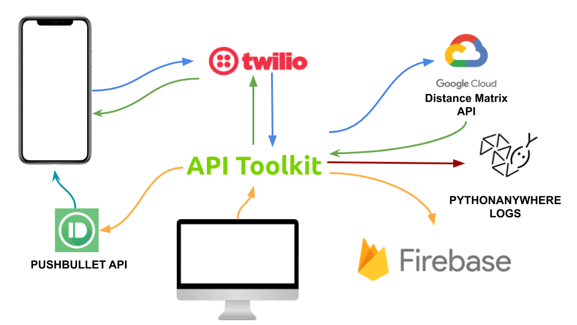
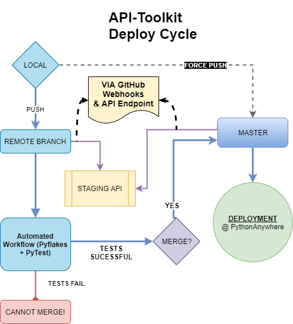

# Welcome to API-Toolkit!
Hi, this is a personal project. I did it for fun, to learn more about API Development, and to solve some challenges I had in my day-to-day life. 

___

### Index
- [What does this API do?](#what-does-this-api-do)
- [What was the motivation behind this project?](#what-was-the-motivation-behind-this-project)
- [How did I do it?](#how-did-i-do-it)
- [What tech stack does it use?](#what-tech-stack-does-it-use)
- [How does it work?](#how-does-it-work)
    - [Web Analytic Engine](#web-analytic-engine)
    - [Twilio's SMS Service](#twilios-sms-service)
- [Why is there no logging inside the code?](#why-is-there-no-logging-inside-the-code)
- [How is it deployed?](#how-is-it-deployed)
- [Why does the code fail when the repo is cloned?](#why-does-the-code-fail-when-the-repo-is-cloned)
    - [How do I run it locally?](#how-do-i-run-it-locally)
- [Challenges I faced while developing this project](#challenges-i-faced-while-developing-this-project)
- [How much did it cost to make this service and consume the external APIs?](#how-much-did-it-cost-to-make-this-service-and-consume-the-external-apis)
- [Can I contribute?](#can-i-contribute)
    - [Contact](#contact)
    - [Licensing](#licensing)
___ 
### What does this API do?
This API serves two purposes:
1) Tracks personal website traffic while:</br>
a) Storing it in Google's Firebase Cloud Firestore Database.</br> 
b) Sending a Pushbullet notification to my mobile device on each visit.</br>
2) Processes an incoming SMS Request from my mobile and then:</br>
a) Computes traffic times for the input co-ordinates  </br>
b) Sends back the computed time via SMS to my mobile  </br>
3) Sends Contact Form to: </br>
a) Pushbullet Mobile Notification </br>
b) Google's Firebase Cloud Firestore Database. </br> 

___

### What was the motivation behind this project?
1) When I initially hosted my website, I wanted to track the number of daily visitors and filter them by geographical locations. I decided to use Google Analytics initially. However, soon I realized that this analytic engine had scattered data, and it did not satisfy my requirements.

2) Mobile data is also fairy expensive in Canada. For my internship, I travel 4 hours each weekday, and checking Google Maps for traffic times consumes my limited mobile data at a drastic pace. 

3) I wanted to send contact form information to me and store it without taking the user to an external website. All existing Forms services like Typeform are either paid or require external captcha's to function.

I knew I had to solve these problems by making my own service as the one's available on the market were either paid, or too complicated to customize.

___

### How did I do it?
I decided to solve the above 3 problems by making my own **web-analytics** engine, **forms api** as well as **a messaging service**. I was sure I needed a seperate back-end as I planned on integrating multiple external APIs and I **did not wish to expose API keys on the client-side code**.

I am/was also working on API Development for Canadian Imperial Bank of Commerce (CIBC) for my internship, and decided that an **API** would be the best way to tackle such problems. 

I looked at various API frameworks, such as Spring-Boot + Maven + Java, Ruby on Rails, and also learned a little about GraphQl. 
I finally decided to make the service using **Python language** and **Flask framework**.

___

### What tech stack does it use?
The back-end service is based on Python and the framework used is Flask. 
Here are the external APIs used:

|API | Purpose|
|--|--|
|***WEB API* & *Forms API***||
|Google's Firebase Cloud Storage| Storing Web Analytics Data in Cloud Firestore. 
|Pushbullet API| To send notification to mobile device whenever website is visited.
|***SMS API***||
|Twilio's API| To receive and send messages via SMS.
|Google's Distance Matrix API| To compute travel time with traffic for requested co-ordinates.
|***PYTEST INTEGRATION***||
|GitHub's REST API| To receive latest commit's hash for specified branch.
|API-Toolkit ***(CURRENT API)*** | To receive branch and hash, then compare it with latest hash for the branch using GitHub's API.
  
The code is hosted on PythonAnywhere and has an estimated [99.7% uptime](https://www.pythonanywhere.com/forums/topic/2026/).
___

### How does it work?
##### Web Analytic Engine:
1) When someone visits the website, it consumes **IPAPI's** API via an AJAX call to fetch the Public IP Address as well as some other parameters.
It also gets a Unique Fingerprint ID (UID) using an external Fingerprinting Script
2) The website then sends a **POST Request** to **/analytics endpoint** via XMLHttpRequest method. This POST request contains the IP Address, the UID and the other fetched data.
3) The API Service then checks if the UID is one of my personal devices. If it is not, it calls the Pushbullet API and sends a notification to my phone.
4) The API Servcie then sends the collected data to Firebase Firestore Cloud Storage.  
5) The API returns success or error message. The website has no affect from this transaction.
##### Twilio's SMS Service:
1) A verified user sends an SMS to the Twilio Number.
2) Twilio sends the message via a POST request to the **/SMS Endpoint**
3) The API service then decodes the message body in the request received to extract the "FROM" and "TO" waypoints.
4) The service then consumes Google's Distance Matrix API and then computes the time taken to travel in traffic.
5) The API service then calls Twilio function to send a SMS message back to that number.
##### Forms API:
1) A website visitor fills the form and clicks send.
2) A **POST request** is made to my **/form Endpoint**
3) The API service then decodes the message body in the request received to extract the JSON data.
4) The service then consumes Pushbullet API and sends a notification to my phone.
5) The API service then calls Google's Firebase service to store the form data in a secure manner.


___

### Why is there no logging inside the code?
Since the API is hosted on PythonAnywhere, automatic logging happens for the following:
- Access Logs
- Error Logs 
- Server Logs

Due to this, there is no need of explicit logging. Moreover, edge cases have been considered for client facing endpoints.

However, if needed, logs can still be implemented. Refer to [this](https://realpython.com/python-logging/) for more info 

___

### How is it deployed?
The API is deployed on PythonAnywhere.

I set up an automatic deployment from the **Master** branch to **PythonAnywhere** using **GitHub Webhooks**.
> Kindly refer to [this](https://medium.com/@aadibajpai/deploying-to-pythonanywhere-via-github-6f967956e664) for more info on live deployment via Local > GitHub > PythonAnywhere. 
- **Branch rules** have been set up to prevent direct pushes to master (deployment) branch.
- An **automated GitHub workflow (action)** runs on every push. This **checks the dependancy requirements**, runs **pyflakes** on the repository and then runs a deployment check using ***PYTEST***.
- Every single push event on Master is updated to the PythonAnywhere server where it is deployed instantly.
- If any deployment fails, I am alerted via email by **[Uptime Robot](www.uptimerobot.com)**.

<p align="center">
  
</p>

___

### Why does the code fail when the repo is cloned?
Since the code is dependent on multiple APIs, it needs the secret keys inside the [secrets](secrets) folder to run. Methods to obtain the secret keys can be found [here](./secrets/readme.md).

#### How do I run it locally?
To run the service locally:
- Clone the repository onto local system.
- Obtain the various API keys and store in the secrets folder. (The API is dependent on all those different APIs. Please reach out to me at [my email](#contact) if any help is required.
- Add the following code at the bottom of [main.py](main.py)
```
if __name__ == "__main__":
    app.run(debug=True, host='0.0.0.0', port='8080')
```
- Run [main.py](main.py)
- Go to http://localhost:8080/status to check if it is running or not.
- Check for errors if any.
- Expose the API to the internet using a service like **[ngrok](https://ngrok.com/)**.

___

### Challenges I faced while developing this project:
I faced a few challenges when developing this service.
I consider these to be basic lessons for anyone developing consumer-facing APIs:
- Bypassing **CORS** (Cross Origin Resource Sharing) to allow browsers to consume APIs.
- Securing endpoints with either  
    a) OAuth JWT Tokens  
    b) **API Keys** (This is what I used)  
    c) Cookie forwarding with headers  
    d) SSL or certificate verification  
- **Continuous integration** with whatever deployment you are using. Changing the same code at 2 different places (GitHub and host) is a very tedious process, which might create redundancy and disparity between working code.
- Setting up an API **Alert** if the server/deployment goes down. I used **[Uptime Robot](www.uptimerobot.com)** for this.

___

### How much did it cost to make this service and consume the external APIs?:
It cost me ***$0*** to make this API service.
Yes I did consumer external APIs, however, all of them are either free or offer a free tier/trial account. 
- The Hosting at PythonAnywhere was free of cost.
- Twilio offers a free trial account.
- Pushbullet is free to use.
- Google Distance Matric API offers a limited credit each month for fair usage.
- Google Firebase offers a free and fair usage quota.
- Uptime Robot was also free to use. 

**What about Usage Limits?** 
Yes, there are some motnhly/daily usage limits. However, these limits are way higher than the usual consumption for our use cases.

___

### What is the SDLC for API Development?
API Development from scratch usually involves the same 5 steps as any code release does:
#### - Design
- Before development begins, there needs to be a design document that states the different endpoints the API would have, and how each of these endpoints work.
- This is known as **Design First** Based Approach
- For each piece of code written in your life, you would have an idea of what you were doing before you began coding, just writing these ideas into a document solidifies your design principles and ensures consistency.
- Tools: SwaggerHub 
#### - Create
- Once the API is designed, it is built with respect to the design document, with required changes to both the code as well as the document being made on the fly.
- Tools: Python with Flask, Java + SpringBoot + Maven, Python with Django, Ruby on Rails, NodeJS
#### - Test 
- Once the API is ready to be published, it should be tested thoroughly. This should be done by adopting different testing methodologies, such as Unit Testing, Integration Testing, White and Black box testing.
- This is where load testing should be done for your API as well.
- Tools: LoaderIo, CrossBrowserTesting, CORS test
#### - Deploy
- Once your API is tested and ready to be released into production, it can be run locally and exposed to the internet via a self hosted server or external services such as Ngrok.
- The industry standard is to release APIs to the cloud using services such as AWS, Google Cloud Platform, DigitalOcean or small scale applications like PythonAnywhere. 
#### - Monitor
- Monitoring tools should be set up to measure performance of the deployed API.
- This can either be done manually by setting up loggers and reviewing them frequently.
- Another method is to set up automatic performance measurement tools which measure important KPIs for your API.
- Tools: AlertSite, UptimeRobot
___
### Can I contribute?
**Ofcourse!!** I'll be more than happy to discuss any improvements and suggestions.
- If you have a code idea, please [CONTRIBUTE!!](https://codeburst.io/a-step-by-step-guide-to-making-your-first-github-contribution-5302260a2940)

#### Contact
- If you want to discuss something else, kindly email me at anant.j2409@gmail.com

#### Licensing
- Please be respectful of the [LICENSE](LICENSE) when working with the code.
___
>Author: Anant Jain
 
 [TOP](#welcome-to-api-toolkit)

***END***
___
